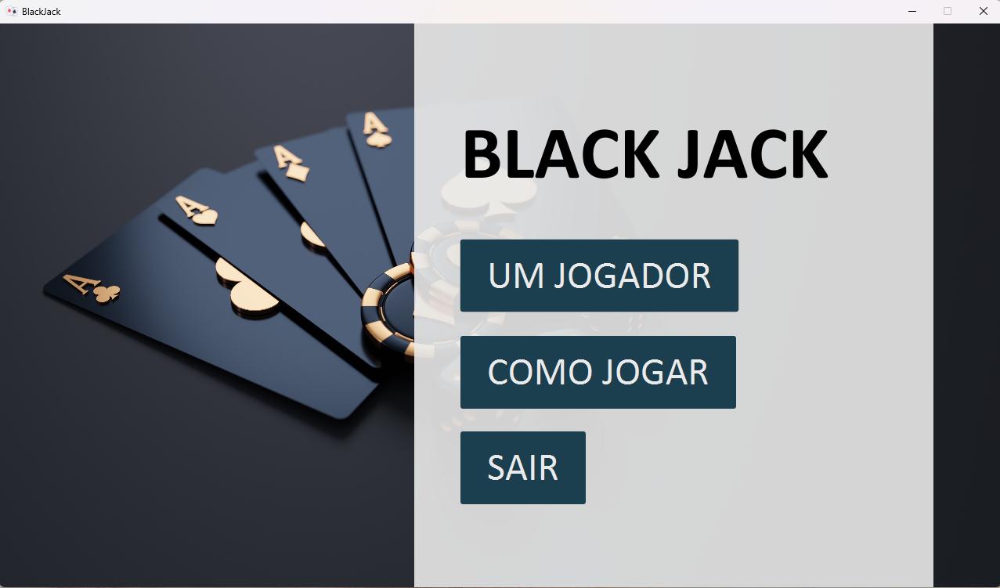
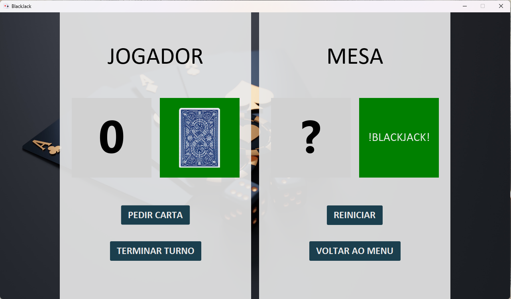
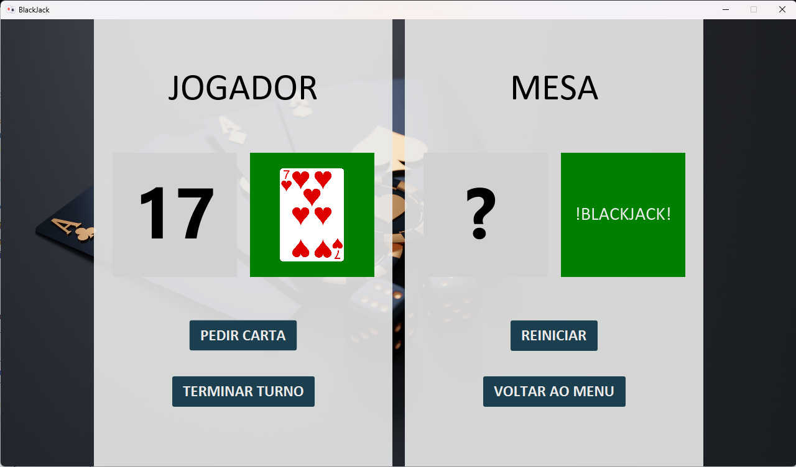
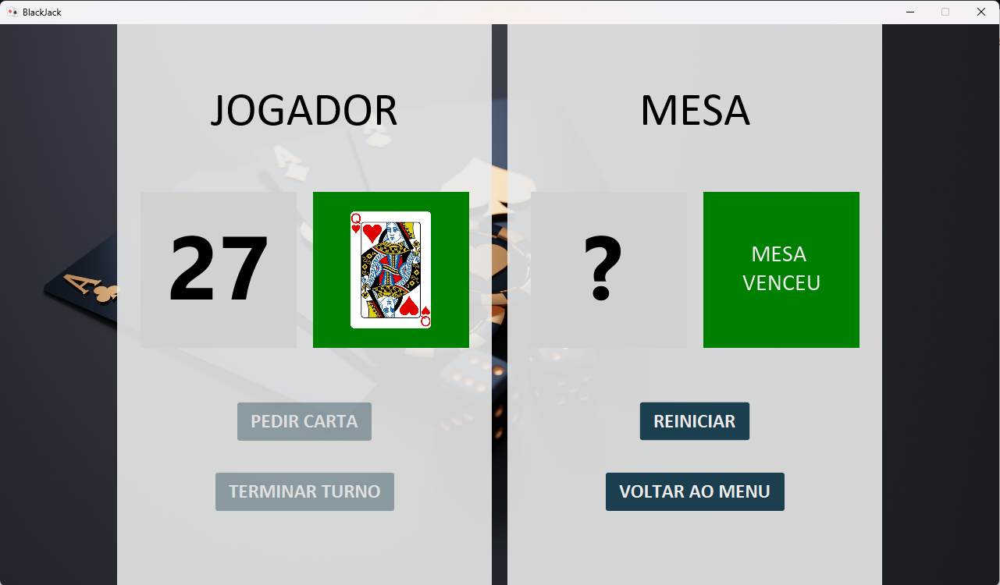
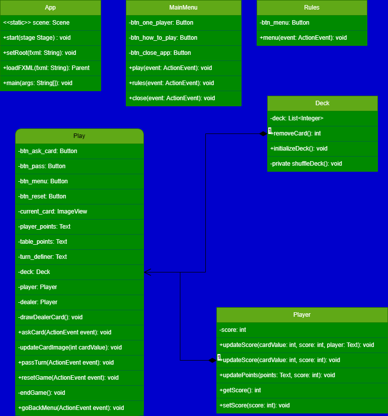

# :clubs: Black Jack :clubs:
Igualmente conhecido como Vinte-e-Um. As regras são simples, o jogo é emocionante e há oportunidade para uma estratégia elevada. De fato, para o jogador experiente que joga matematicamente um jogo perfeito e é capaz de contar as cartas, as probabilidades de ganhar estão por vezes a seu favor.

Mas mesmo para o participante casual que joga um jogo razoavelmente bom, as probabilidades do casino são menores, tornando o Blackjack um dos jogos de casino mais atractivos para o jogador. Embora a popularidade do Blackjack date da Primeira Guerra Mundial, as suas raízes remontam à década de 1760 na França, onde é chamado Vingt-et-Un (francês para 21). Atualmente, o Blackjack é o único jogo de cartas que pode ser encontrado em todos os casinos americanos. Sendo um jogo popular em casa, é jogado com regras ligeiramente diferentes. Na versão de casino, a casa é o dealer (uma "banca permanente"). No jogo de casino, o dealer permanece de pé e os jogadores sentados. O croupier é responsável por todos os aspectos do jogo, desde baralhar e distribuir as cartas até gerir todas as apostas. No jogo em casa, todos os jogadores têm a oportunidade de ser o croupier (uma "banca variável").

## Objetivo do Jogo :game_die:
Cada participante tenta vencer o dealer obtendo uma contagem próxima ou igual a 21, sem ultrapassar 21.

## Valores das cartas/ Pontuação :dart:
Cabe a cada jogador decidir se um ás vale 1 ou 11. As cartas com cara valem 10 e qualquer outra carta vale o seu valor de pip.

### In English

# :clubs: Black Jack :clubs:
Also known as Twenty-one. The rules are simple, the game is exciting and there's plenty of opportunity for strategy. In fact, for the experienced player who mathematically plays a perfect game and is able to count the cards, the odds of winning are sometimes in their favor.

But even for the casual participant who plays a reasonably good game, the casino odds are lower, making Blackjack one of the most attractive casino games for the player. Although Blackjack's popularity dates back to the First World War, its roots go back to the 1760s in France, where it is called Vingt-et-Un (French for 21). Today, Blackjack is the only card game that can be found in all American casinos. Being a popular home game, it is played with slightly different rules. In the casino version, the house is the dealer (a "permanent banker"). In the casino game, the dealer stands and the players sit. The dealer is responsible for all aspects of the game, from shuffling and dealing the cards to managing all the bets. In the home game, every player has the opportunity to be the dealer (a "variable bankroll").

## Game Goal :game_die:
Each participant tries to beat the dealer by getting a count close to or equal to 21, without going over 21.

## Card values / Scoring :dart:
It's up to each player to decide whether an ace is worth 1 or 11. Face cards are worth 10 and any other card is worth its pip value.

## Screenshots

###

###

###

###

##

## Diagrama de Classes

